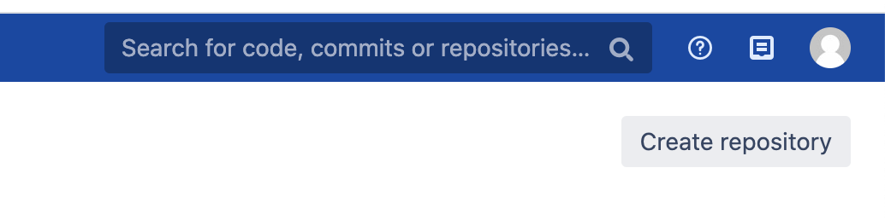
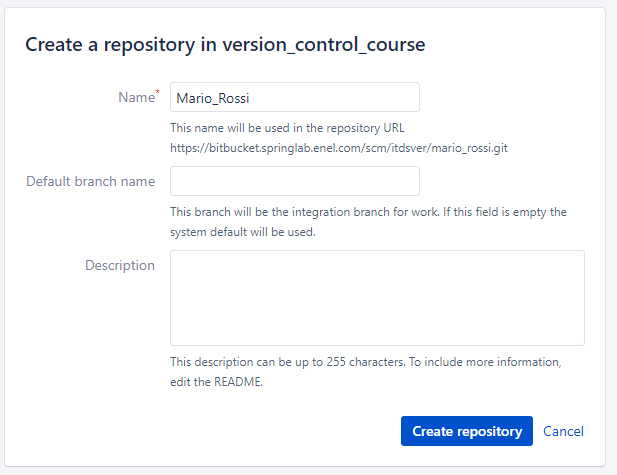

## Step 1 - Create new repository and initialize a project
In this step:
* you'll create a new repository in the **version_control_course** bitbucket project available [here](https://bitbucket.springlab.enel.com/projects/ITDSVER) 
* you'll create a new project locally
* you'll sync your local repository with the remote one

##### Prerequisites
* You must have an Enel account and be able to access the Springlab environment.
* You must have the right permission level to create a new repository in the 
**version_control_course** project

##### Create new Repository
First of all we need a new remote repository. Such repository will host our awesome code.


Go to [version_control_course](https://bitbucket.springlab.enel.com/projects/ITDSVER) project on Springlab and create a new repository using the "Create Repository" button at top right corner.



The repository name must be the concatenation of your name and surname with "_" as delimiter.

> Name: Mario, Surname: Rossi -> Repository name: Mario_Rossi



Once you create the repository, if you come back at the [version_control_course](https://bitbucket.springlab.enel.com/projects/ITDSVER) project you'll see the new repository in the repositories page.

##### Create your local project 
Now it's time to write some code and begin your new project. This project will be host on the repository created at step before.

Before write some code we need to configure Git with our username and password:

```git config --global user.name "<your-name>"```{{copy}}

```git config --global user.email "<your-enel-email-address>"```{{copy}}

Create a new local folder called project:

```mkdir /home/scrapbook/tutorial/project```{{execute}}

create a file called *calculator.py* in the project folder.
```cd /home/scrapbook/tutorial/project && touch calculator.py```{{execute}}

modify the file and paste this content:

```python
class Calculator:
    def sum(self, a: int, b: int):
        return a + b
```

`./project/calculator.py`{{open}}

Now, initialize the local repository and add all files:

```git init```{{execute}}

```git add --all```{{execute}}

```git commit -m "First commit"```{{execute}}

This commit resides in your local repository for sure and now we are ready to *sync* your local repository to the remote repository created.

We'll use the `git remote add` command to do this.

Issue the command below 

```git remote add origin https://bitbucket.springlab.enel.com/scm/itdsver/<your repository name>.git```{{copy}}

substituting `<your repository name>` with the actual name of repository you created before.

> E.g.: Mario_Rossi is the name of repository, the command is `git remote add origin https://bitbucket.springlab.enel.com/scm/itdsver/mario-rossi.git`

With this command we've added a new origin and we can push on remote repository to sync our changes.

Let's check what happend under the hood with the `git remote -v`{{execute}} command.

The command's output should be:

```shell
$ git remote -v
origin  https://bitbucket.springlab.enel.com/scm/itdsver/<your repository name>.git (fetch)
origin  https://bitbucket.springlab.enel.com/scm/itdsver/<your repository name>.git (push)
```

`origin` is the name of the remote added. You can use which name you want but make sure you specify the right remote name when you use `git push` command.

Finally, we can push our changes to this new remote!

```git push -u origin master```{{execute}}

You must insert your username that corresponds to your Enel id with the first letter in uppercase. (*E.g. A459578*) and your Enel account password.

 *Note: If you use an HTTPS URL to push, the Git server will ask you for your username and password for authentication.
If you don’t want to type it for every push, you can set up  `git config --global credential.helper cache`*

##### Exercises

---
**Exercise 1**
See what happened (through your browser) on bitbucket repository after your first push.

---

**Exercise 2**
Try to rename the `origin` remote name to `enel` (then check with `git remote -v`) and make a new push to this remote. 

---

**Exercise 3**
Add a new function in `calculator.py` that executes the division between two number and push this new code.
