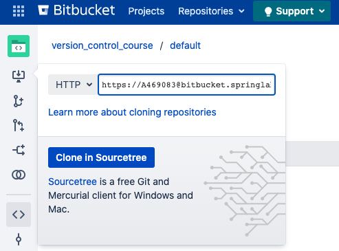

## Step 1 - Create new repository and initialize a project
In this step:
* we will clone locally an existing remote repository in the **version_control_course** bitbucket project available [here](https://bitbucket.springlab.enel.com/projects/ITDSVER) 
* we'll create a new project locally
* we'll sync our local repository with the remote one

##### Prerequisites
* You must have an Enel account and be able to access the Springlab environment.
* You must have a partner. (*Collaboration* is the key! :-))

##### Clone an existing repository
Your collegaues started a new project few months ago and now want you as developer because they have an huge amount of work.


The address of the existing repository is: https://bitbucket.springlab.enel.com/projects/ITDSVER/repos/default/browse

In order to start writing some code do you need your local copy of that repository and begin to work locally and then sync with the remote one. You just need the `git clone` command.


In order to clone this repo you must have a *.git address*.
To obtain such address please navigate through your browser to the link above e click on the clone button:



Switch to *HTTP* protocol and copy the link in your clipboard.

The copied link looks like:

`https://<your-enel-id>@bitbucket.springlab.enel.com/scm/itdsver/default.git`

Now, we can clone this repo with the following command (substitute the <your-enel-id> with your real Enel id of cours ):

```git clone https://<your-enel-id>@bitbucket.springlab.enel.com/scm/itdsver/default.git```{{copy}}

Now you have your cloned local repository. This local repository is in sync to remote and contains all the commit, branches and the history hosted in the remote repository.

##### Exercises

---
**Exercise 1**
See the log of the remote repository after cloning.

---

**Exercise 2**
What's the name of the remote added by the clone command?

---

