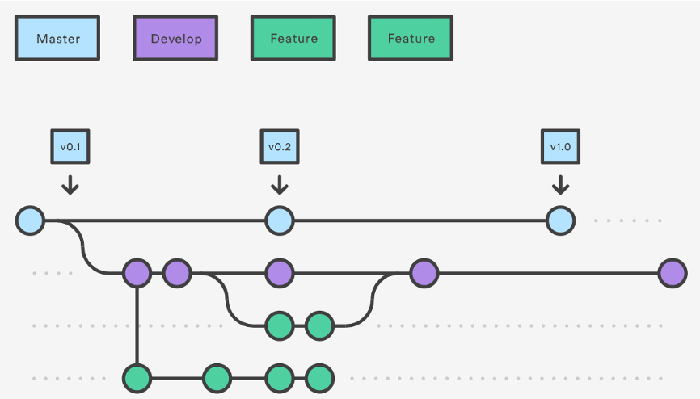

## Step 3 - Git Workflow
In this step:
* you'll learn how to properly use git for pure collaboration
* you'll learn what's a git workflow is
* you'll focus on **feature branch** workflow

##### Prerequisites
* You must have an Enel account and be able to access the Springlab environment.

##### Git Workflow

You are part of a big team and all developers are working on the same project on a remote repository. To be productive and efficient you must use Git in the proper way. 

Git Workflow is a recipe for how to use Git to accomplish work in a consistent and productive manner. 
Suppose you are working on a Calculator project and you must modify the `calculator.py` file for adding a new feature or fixing a bug.

Without a clear workflow you'll made your modification on your local repository and then you'll sync your local change on the remote master branch.

This approach has many disadvantages:

* `calculator.py` contains core functionalities and your modifications could contains errors and bugs. Therefore, master branch could not contain a working code version and you are not working in a **consistent** and **productive** way.
* You are not working in a **collaborative** way because the other developes doesn't know what changes you done before changing the master branch.
* The probability of unhandled conflicts increase.

To avoid this situation you must follow a specific workflow that helps you using Git in order to avoid situations like the one described above.

One of the most git workflow used in project developlment is the **Feature Branch** git workflow.

At the core of this workflow there are two infinite lifetime branches at the remote repository:
* **master** branch where the source code reflects the *production-ready* state.
* **develop** branch where the source code reflects a state with the latest delivered development changes for the next release.

Next to the master and develop branches the feature branch workflow use multiple supporting branches to increase collaboration and productivity between team members. 

Those branches have a short lifetime and are called feature branches and have a specific purpose. We can use a feature branch for develop new feature for the next release so the feature branch exists as long as the feature is in development. 
In a typical scenario, when you are ready to develop a new feature you must create a new feature branching off *develop* branch. When you finish this feature branch must be merged back into develop to definitely add them to upcoming release.

The graph below shows this workflow:



To see a concrete implementation of this workflow, clone the **awesome project** repository:

```git clone https://<your-enel-id>@bitbucket.springlab.enel.com/scm/itdsver/awesome_project.git```{{copy}}

> Remember to replace your Enel id before the '@'.

and then use the `git log` command with some useful arguments:

```cd awesome_project && git log --all --decorate --oneline --graph ```{{execute}}

The output should looks like this:

```shell
*   e40b952 (HEAD -> develop, origin/develop) Merge pull request #1 in ITDSVER/awesome_project from feature-adding-comments to develop
|\  
| * 60cd855 (origin/feature-adding-comments, feature-adding-comments) add some documentations
|/  
* c16c590 next calculator with * operator
* 9e29755 (origin/master, master) added calculator
```

There are some interesting informations:

1. There is a branch called **feature-adding-comments** with one commit *"add some documentation"*
2. This branch was merged into develop and the message of the merge commit message is *"Merge pull request #1 in ITDSVER/awesome_project from feature-adding-comments to develop"*

This is a concrete application of the feature branch git workflow! 

What's a pull request? We'll know more on the next step.

In the next step we'll create our first feature branch.


##### Exercises

---
**Exercise 1**
Suppose you have to fix a bug instead of develop a new feature. Can you follow this workflow? 

---

**Exercise 2**

Why, for developing a new feature, we should branch off develop instead of master? 

---

**Exercise 3**

Try to modify the `calculator.py` file in `develop`, push your changes and see what happens.

---