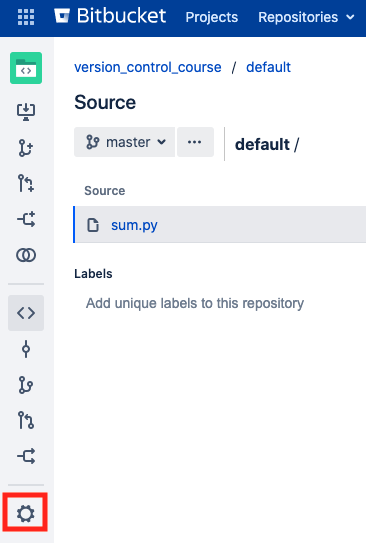
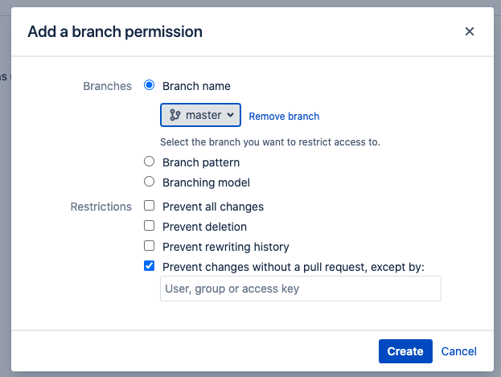
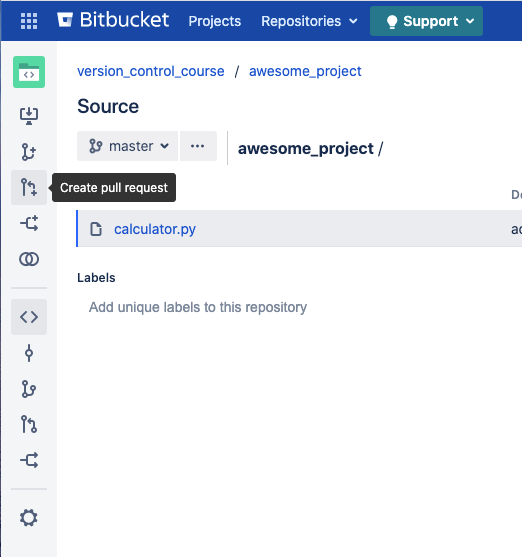
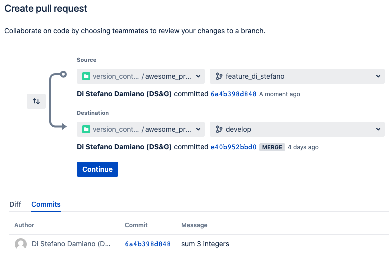
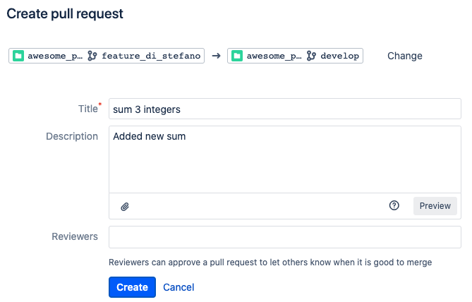

## Step 4 - Pull Requests
In this step:
* you'll modify the branch permission of your repository
* you'll create your first feature branch
* you'll create your first pull request
* you'll leave your first comment on a pull request
* you'll update a pull request
* you'll merge the pull request in the main code branch

##### Prerequisites
* You must have an Enel account and be able to access the Springlab environment.

##### Configure branch permission
As you saw in the last exercise of the previous step, applying a specific workflow like the feature branch one means that you have to limit some branch permission in order to avoid modifications to master and/or develop branches.

To setup your new remote correctly go to the repository page you created at step #1 in the [version_control_course](https://bitbucket.springlab.enel.com/projects/ITDSVER) project and click on *Repository Settings* button on the left pane.



Then, go to branch permission and add a new branch permission for the **master** branch.

In order to enable the feature-branch workflow we must avoid changes directly into the master branch selecting the permission *"Prevent changes without a pull request"* and leaving the exception textbox field empty.



##### Create your first feature branch

Now it's time to create your first feature branch.

Go on the awesome_project folder where you cloned the project in the previous step:

```cd /home/scrapbook/tutorial/awesome_project```{{execute}}

and create the feature branch. The feature branch name must be the concatenation of `feature` keywork plus your name and surname with "_" as delimiter .

> Name: Mario, Surname: Rossi -> Feature name: feature_mario_rossi

We'll work on this branch, so use `git checkout` to switch the working branch.

```git checkout -b <your-feature-branch-name>```{{copy}}

Now we must add a new feature in the awesome_project adding a new file:

```touch /home/scrapbook/tutorial/awesome_project/my_feature.py```{{execute}}

Edit the file and add whatever you want.

`./home/scrapbook/tutorial/awesome_project/my_feature.py`{{open}}

Now, your new amazing feature is developed and you are ready to commit and push to remote repository.

```cd /home/scrapbook/tutorial/awesome_project && git add .```{{execute}}

```git commit -m "added new feature"```{{execute}}

```git push -u origin <your-feature-branch-name>"```{{copy}}

##### Pull request

Now your new feature has been pushed to the remote repository. But we cannot push directly on develop because the push is blocked by a specific repository setting. 

In the step before we focused on *feature branch* workflow and we need to integrate our feature in the next release code that resides in the develop branch.

The only way we have to do this is to create a **Pull Request.**

**Pull requests** let you tell others about changes you've pushed to a branch in a repository on GitHub. Once a pull request is opened, you can discuss and review the potential changes with collaborators and add follow-up commits before your changes are merged into the base branch.

##### Create a pull request

Now it's time to discuss your changes with other guys. 
Go to the [repository address](https://bitbucket.springlab.enel.com/projects/ITDSVER/repos/awesome_project/browse) with your browser and click on *Create pull request* button on the left pane.



Every Pull Request must have some mandatory fields:

* a source (project + branch)
* a destination (project + destination)
* a title
* one or more approvers




In the figure above we're creating a pull request from the `feature_di_stefano` branch to `develop` branch.

Execute the same step substituting `feature_di_stefano` with `your-feature-branch-name` and click on **Continue** button.

Now you should insert the title of this Pull Request and the approvers.



> Add yourself as an approver.

Finally, you can create the Pull Request with the **Create** button.
Every user added in the Reviewers field will be notified.

##### Comment and update a pull request

Now you can view your pull request through your browser and the approvers can leave some comments to require some changes or clarifications. 

To update a pull request you have to simply add a new commit to your feature branch and then push to origin.

##### Approve pull request and merge

Approvers can accept the changes with the *Approve* button at the right top of pull request page.

##### Exercises

---
**Exercise 1**
The repository you created at step #1 is now enabled for the feature branch workflow. The master branch is locked and you can't push.

In this exercise you have to:

1. Create a new feature branch with some changes
2. Update your pull request
3. Merge your feature branch into the master branch

---

**Exercise 2**
The repository you created at step #1 is now enabled for the feature branch workflow but the `develop` branch is missing.

In order to fix this situation you have to:

1. Create the `develop` branch from master.
2. Set the proper branch permission to `develop` branch.
3. Create a feature branch from `develop` make some modifications and then create a PR `feature-branch -> develop`
4. Merge this PR
5. Create a PR from `develop -> master`
6. Update `master` branch merging the last PR
