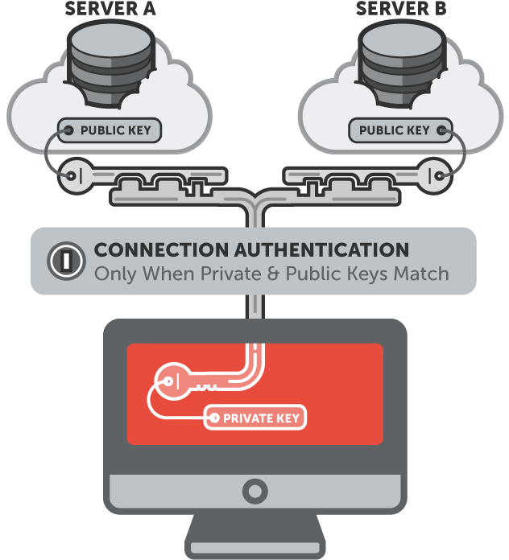
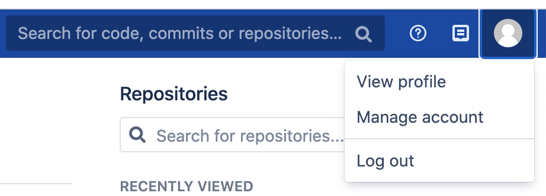
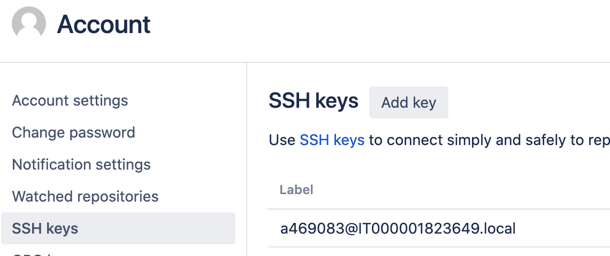
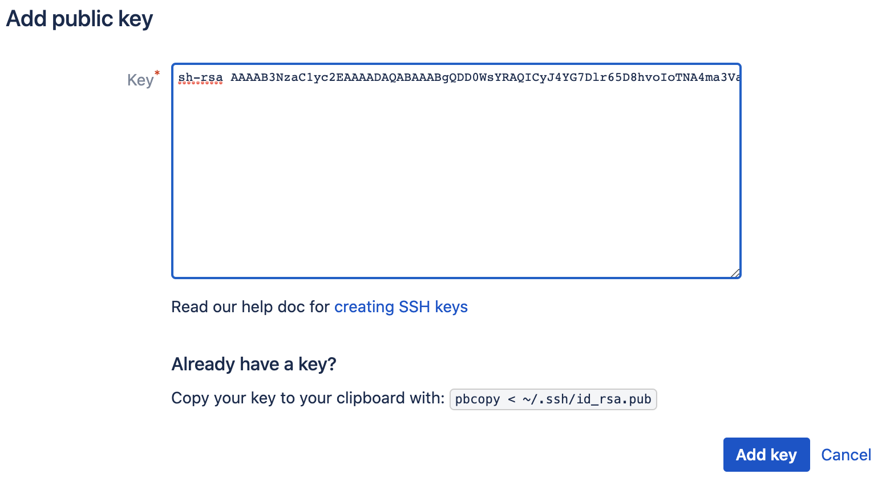

## Step 5 - SSH Keys
In this step:
* you'll create your ssh public and private keys
* you'll add your public key in bitbucket
* you'll clone a remote repository without typing your username and password

##### Prerequisites
* You must have an Enel account and be able to access the Springlab environment.
* You must have an **Enel VPN** (Checkpoint Endpoint security) up & running.
* You must have installed git in your computer. (GitBash on Windows)

Is a little bit frustrating to type your username / password every time you use commands like `git clone` or `git push`.

##### Key Authentication concept
When you use the ssh protocol you have to use ssh keys for authentication.

For this type of authentication a **two-part** key is used: a public and a private one.

The private key must be kept absolutely private to you under all circumstances. Its public counterpart, in contrast, is supposed to be installed on all servers (E.g.: BitBucket) that you want to get access to.
When a connection via SSH is trying to be established, the server will only grant access if it has a public key installed that matches the private key of the requesting computer.



So, the first step is to generate your two keys. (public + private)

##### Create your ssh keys

>On Windows environment you can only enter the commands listed below into the **Git Bash** window.

To generate the keys you need to use the `ssh-keygen`{{copy}} command.

When the `ssh-keygen` command is issued, the terminal will prompt a couple of questions and at the end of the process the result will looks like the block below:

```
$ ssh-keygen
Generating public/private rsa key pair.
Enter file in which to save the key (/c/Users/<username>/.ssh/id_rsa):
Created directory '/c/Users/<username>/.ssh'.
Enter passphrase (empty for no passphrase):
Enter same passphrase again:
Your identification has been saved in /c/Users/<username>/.ssh/id_rsa.
Your public key has been saved in /c/Users/<username>/.ssh/id_rsa.pub.
The key fingerprint is: e7:94:d1:a3:02:ee:38:6e:a4:5e:26:a3:a9:f4:95:d4
```

**You have to hit enter for all questions to leave default values**. Doing so, you'll have the public and private keys stored in the default location (under `/c/User/<username>/.ssh/` in Windows and under `~/.ssh in Linux/macOS)

Now you have created your ssh keys and you can see their content on the default location.

##### Install public ssh key on the server.
Now you have to install the **public** key on the server. In this way, the server can authenticate you against this public key.

Open the `id_rsa.pub` file, this file should look like the block below except for the `user@host` at the end of the host:

```
ssh-rsa AAAAB3NzaC1yc2EAAAADAQABAAABgQDD0WsYRAQICyJ4YG7Dlr65D8hvoIoTNA4ma3VaEfKKpFweoePPxjhTuenl/8DgE9NL+pncAinvKprkxW45dQNJf0jnZNulZuSfHAH7j6SOgtjfQEMkgispxWBCxiOyTnTO2k2Flg5uEHqXVB2/UMRyF2kQAd5+Vk9cG5yKZRncSXPsPAllaXIc7kNgKalgZU1BOt36+8y9t9b+mAHeloQH7PWcTVq4K8qet+ksPD8zxTpM1+A0wN0rfMQe9gcfTKtOkRKnYJZNv1uIMvLoP3wqSg75x0Q816zow2BWujp6IEnckXXsDWH6IfF/fi88xLhES2NBgS6AlQXwqLH2X6HnkQaota6c8b6s9iMuY9glkwVMm2O8PXSxoKveSiCAiBQBXZm9hDag2yD53SPmKGLEXDt6gsdE9GqwMOvNIuMw/WLy7sGFISjxW1+50o3EncblJhhzRk5plY8bJPJOd8j5RrMYbi93NRSvjPhY/BBHp6RXz06qrtO7dvjKOO0zmg0= root@docker-desktop
```
>It's safe. It's only a public key.

Copy the **entire** content of the file into your clipboard.

Go, through your browser at [bitbucket page](https://bitbucket.springlab.enel.com/dashboard) on Springlab and click on your user icon at the top right corner and then on *Manage Account*.



In the left pane click on *SSH Keys* and the to *Add Key*



Past the content of public key you have in your clipboard.



Now your public key have been registered on the server!

##### Using the key authentication with git commands.

With this configuration, when you clone a repository or make a push with ssh protocol you don't have to type your credential because you'll automatically take advantage of the key authentication type. 

>**To use ssh protocol with bitbucket repository in springlab you must be connected with an EnelVPN (use smartvpn or globalssl endpoint)**


You can clone the `awesome project` repository with ssh in your local computer without enter your credentials:

`git clone ssh://git@bitbucket.springlab.enel.com:7999/itdsver/awesome_project.git`{{execute}}


##### Exercises
**Exercise 1**
Make a push in awesome project (remember: `master` and `develop` branches are locked!)

---
**Exercise 2**
Is this configuration working if you are using another PC?

---

**Exercise 3**
Can you use the ssh keys with HTTP protocol?

---

**Exercise 4**
The remote added after cloning with ssh protocol is the same of the one using http protocol? 
